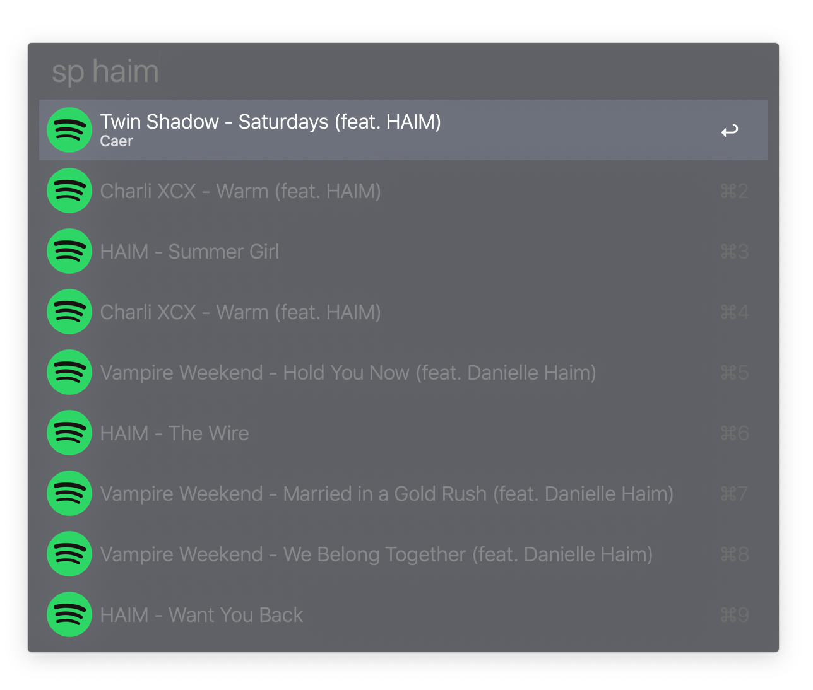

# Alfred-Spotify

Alfred-Spotify searches for tracks (Keyword: `sp`) and albums (`spa`).

## Download

See [Releases](https://github.com/snipem/alfred-spotify/releases).

## Setup

You will have to setup Spotify API tokens as `SPOTIFY_ID` and `SPOTIFY_SECRET` environment variables in the imported workflow.

Currently the default action is to call a custom made Bose Soundtouch script of mine to enqueue the song to the device. You may change the default behaviour to just open the url, like it is currently bound to the `alt` action.
